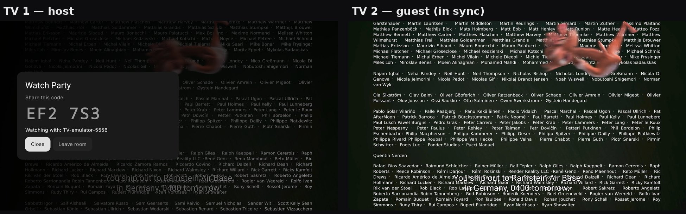
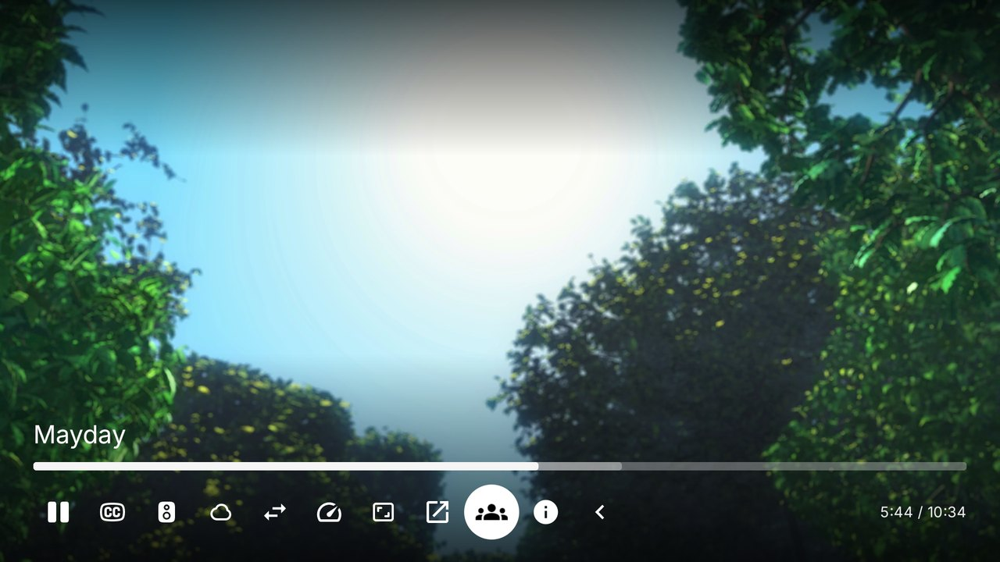
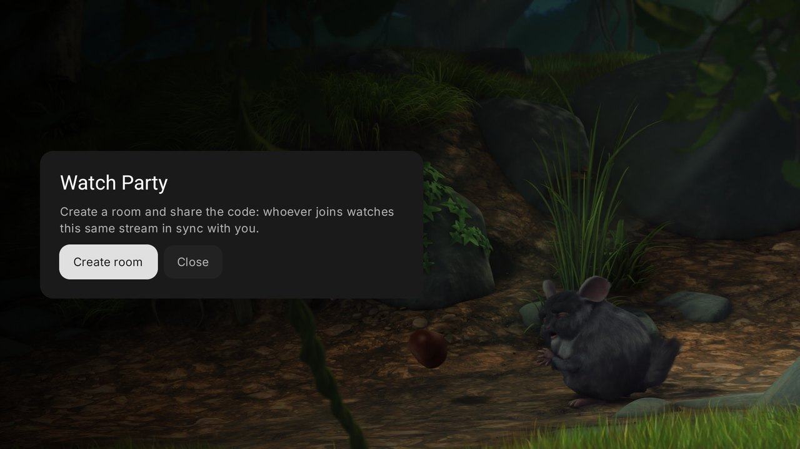
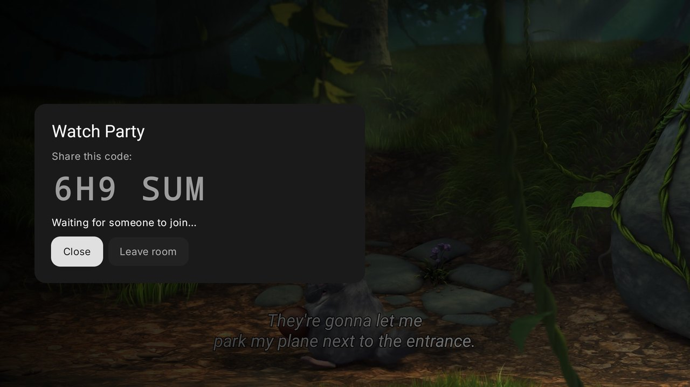
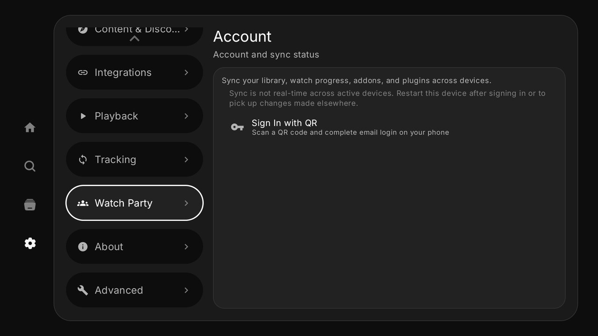
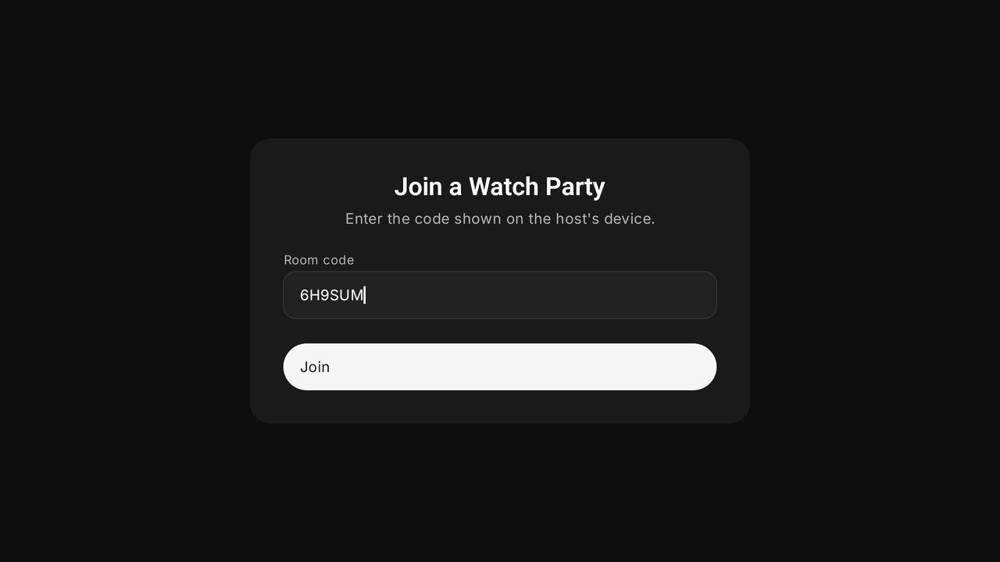

<div align="center">

# 🎉 Nuvio Party — Nuvio with Watch Party

**Watch movies and series *together*, in sync, on different TVs and phones.**
An unofficial fork of [Nuvio](https://github.com/NuvioMedia/NuvioTV) that adds a built-in **Watch Party**.

[](https://github.com/AntoninoScardina/NuvioTV/releases/latest)
[](https://github.com/AntoninoScardina/NuvioMobile/releases/latest)
[](../LICENSE)

**English** · [Italiano](#-italiano)



</div>

---

## ✨ What it does

You're on the couch, your partner or your friends are somewhere else. One person creates a room, the others type a **6-character code**, and everyone watches **the same stream, at the same second**.

- ▶️ **Play, pause and seek are shared.** Anyone in the room can pause, and it pauses for everyone.
- 🔗 **The stream is shared too.** Guests don't need to search for anything: their Nuvio opens **the exact same source** as the host, headers included, so it also works with add-ons that need a referer.
- 🧈 **Smooth, not jumpy.** Small drifts are recovered by nudging the playback speed by a few percent, without any visible skip. It only jumps if someone falls more than 3 seconds behind, for example after a long buffer.
- 📺📱 **TV ↔ phone.** Android TV and phone builds speak the same protocol, so you can mix them.
- 🔒 **Peer-to-peer.** No account and no server of ours. Devices find each other through [VDO.Ninja](https://vdo.ninja) signaling, then talk directly over an encrypted WebRTC data channel.
- 🔄 **Stays up to date.** Every night a GitHub Action merges the latest official Nuvio, rebuilds and publishes a release. The app updates itself from here.

## 📸 How it works

| 1. In the player, open **Watch Party** | 2. Create a room |
|---|---|
|  |  |
| **3. Share the code** | **4. On the other TV: Settings → Watch Party** |
|  |  |
| **5. Type the code and join** | **6. The guest's player opens by itself, in sync** |
|  |  |

On the phone app the button is in the player's action bar, and "Join a Watch Party" is in **Settings**.

## 📥 Install

| Device | Download |
|---|---|
| **Android TV / Google TV / Fire TV** | [`NuvioPartyTV.apk`](https://github.com/AntoninoScardina/NuvioTV/releases/latest/download/NuvioPartyTV.apk) (universal) |
| **Android phone** | [`NuvioParty.apk`](https://github.com/AntoninoScardina/NuvioMobile/releases/latest/download/NuvioParty.apk) (arm64) · [other builds](https://github.com/AntoninoScardina/NuvioMobile/releases/latest) |

**On a TV with the Downloader app**, type this URL:

```
https://github.com/AntoninoScardina/NuvioTV/releases/latest/download/NuvioPartyTV.apk
```

> [!IMPORTANT]
> Nuvio Party uses the **same package name as Nuvio**, so you won't end up with two apps. Android only lets an app be updated by one signed with the same key, which means **the first time you have to uninstall the official Nuvio**. After that, updates install over the existing app from inside Nuvio Party. Sign in with your Nuvio account afterwards and your add-ons come back.

## ❓ FAQ

<details>
<summary><b>Does my partner need the same add-ons?</b></summary>

No. The host sends the resolved stream URL and its headers, and the guest plays it directly. The guest only needs Nuvio Party.
</details>

<details>
<summary><b>Which streams can be shared?</b></summary>

Any HTTP(S) stream, including debrid links and add-ons with custom headers. Torrent/P2P streams can't be shared, because they are served by a local engine on the host's device. Links locked to one IP address won't play for guests on a different connection.
</details>

<details>
<summary><b>Is anything sent to a server?</b></summary>

Only the WebRTC handshake goes through VDO.Ninja's public signaling server. After that, play/pause/position messages and the stream link travel directly between your devices, encrypted by WebRTC. If a direct connection isn't possible, VDO.Ninja's TURN relays are used, and those still can't read the encrypted data.
</details>

<details>
<summary><b>Does my Nuvio account work?</b></summary>

Yes. Sign in with the QR code as usual: your add-ons, library and progress come back, because Nuvio Party uses Nuvio's own servers. Watch Party itself doesn't need an account.
</details>

<details>
<summary><b>How does sync work, technically?</b></summary>

The host is the clock. Every 2 seconds, and on every play/pause/seek, it sends `{position, playing}`. Guests estimate the host's current position and:

- if they are **< 0.4 s** off, they do nothing;
- if they are **0.4–3 s** off, they speed up or slow down by up to 10%, with audio pitch preserved;
- if they are **> 3 s** off, they seek. The seek lands slightly ahead to compensate for the device's measured loading time, and then waits until playback has resumed before correcting again;
- if the host is **paused**, they align exactly. Nobody notices, because the video is paused.

Guests' play/pause/seek actions are sent to the host, which applies them and rebroadcasts. The code lives in [`watchparty/`](../app/src/main/java/com/nuvio/tv/watchparty).
</details>

## 🙏 Credits

- [**Nuvio**](https://github.com/NuvioMedia) by tapframe and contributors: the whole app. This fork only adds the Watch Party. Please support the original project.
- [**VDO.Ninja SDK**](https://github.com/steveseguin/ninjasdk) by Steve Seguin (MPL-2.0): P2P signaling and data channels.
- Inspired by the WatchParty plugin for CloudStream in [ItaliaInStreaming](https://github.com/DieGon7771/ItaliaInStreaming).

This is an **unofficial** fork and is not affiliated with the Nuvio team. It is licensed under **GPL-3.0**, like Nuvio.

If you like it, leave a ⭐. It helps other people find it.

---

## 🇮🇹 Italiano

**Guarda film e serie *insieme*, sincronizzati, su TV e telefoni diversi.**
Fork non ufficiale di [Nuvio](https://github.com/NuvioMedia/NuvioTV) con il **Watch Party** integrato.

### Cosa fa

Una persona crea una stanza, gli altri inseriscono un **codice di 6 caratteri**, e tutti guardano **lo stesso stream nello stesso istante**.

- ▶️ **Play, pausa e salti sono condivisi.** Chiunque nella stanza può mettere in pausa, e si ferma per tutti.
- 🔗 **Anche lo stream è condiviso.** L'ospite non deve cercare niente: il suo Nuvio apre **esattamente la stessa fonte** dell'host, header compresi, quindi funziona anche con gli addon che richiedono un referer.
- 🧈 **Fluido, senza scatti.** I piccoli scarti si recuperano variando la velocità di pochi punti percentuali, senza salti visibili. Si salta solo se qualcuno resta indietro di più di 3 secondi, per esempio dopo un buffering lungo.
- 📺📱 **TV ↔ telefono.** La versione TV e quella per telefono sono compatibili tra loro.
- 🔒 **Peer-to-peer.** Nessun account e nessun server nostro. I dispositivi si trovano tramite [VDO.Ninja](https://vdo.ninja) e poi si parlano direttamente, cifrati con WebRTC.
- 🔄 **Sempre aggiornato.** Ogni notte una GitHub Action unisce l'ultima versione ufficiale di Nuvio, ricompila e pubblica. L'app si aggiorna da sola.

### Come si usa

1. **Chi ospita:** fai partire un film. Nei controlli del player apri il gruppo ">" e premi l'icona **Watch Party** (le persone), poi **Crea stanza**.
2. Leggi il **codice** alla persona con cui vuoi guardare.
3. **Chi entra:** **Impostazioni → Watch Party**, inserisci il codice e premi **Unisciti**. Il player si apre da solo sullo stesso film, allo stesso punto.
4. Da quel momento pausa, play e salti valgono per tutti. Per chiudere il popup usa "indietro" o "Chiudi"; la stanza resta attiva finché non premi **Esci dalla stanza**.

Sul telefono il pulsante è nella barra azioni del player, e "Unisciti a un Watch Party" è nelle **Impostazioni**.

### Installazione

- **TV (Android TV / Google TV / Fire TV):** [`NuvioPartyTV.apk`](https://github.com/AntoninoScardina/NuvioTV/releases/latest/download/NuvioPartyTV.apk). Con l'app **Downloader** inserisci l'URL qui sopra.
- **Telefono Android:** [`NuvioParty.apk`](https://github.com/AntoninoScardina/NuvioMobile/releases/latest/download/NuvioParty.apk).

> [!IMPORTANT]
> Nuvio Party usa lo **stesso nome pacchetto di Nuvio**, quindi non avrai due app. Android però permette di aggiornare un'app solo con un APK firmato dalla stessa chiave, quindi **la prima volta devi disinstallare Nuvio ufficiale**. Dopo, gli aggiornamenti si installano sopra dall'app stessa. Dopo, accedi con il tuo account Nuvio e ritrovi i tuoi addon.

### Limiti

- Gli stream torrent/P2P non si possono condividere, perché passano da un motore locale sul dispositivo dell'host.
- I link legati a un indirizzo IP non partono per chi è su un'altra connessione.
- L'**account Nuvio funziona**: accedi con il QR come sempre e ritrovi addon, libreria e progressi. Il Watch Party invece non richiede un account.

Progetto **non ufficiale**, non affiliato al team di Nuvio. Licenza **GPL-3.0**. Se ti piace, lascia una ⭐!
